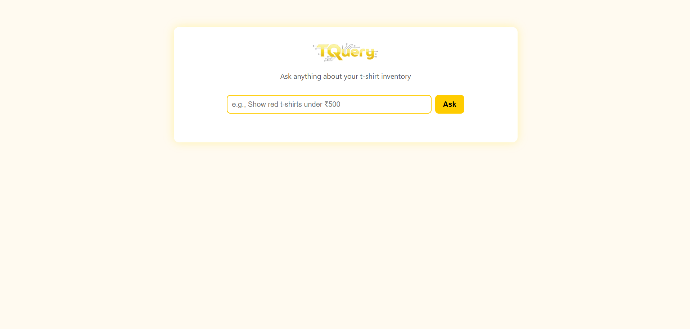
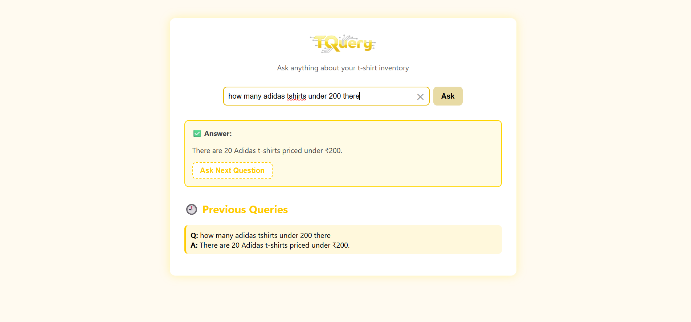
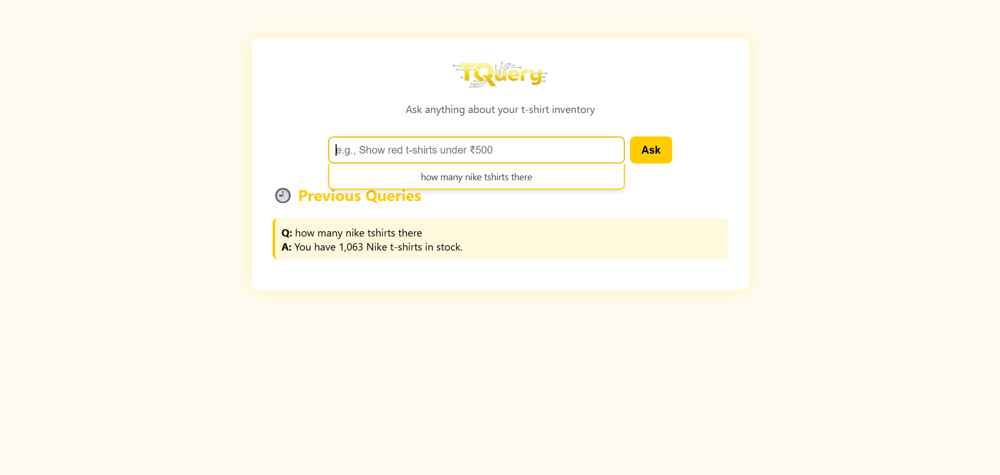

# 🟡 TQuery: AI-Powered T-Shirt Inventory Assistant

**TQuery** is an intelligent conversational assistant that allows non-technical users to interact with a MySQL t-shirt inventory database using natural language. Built with **Google Gemini 2.5-flash**, **LangChain**, **FastAPI**, and **React**, the system translates user queries into SQL, executes them on a live database, and returns beautifully formatted responses.

Perfect for t-shirt store managers who need to quickly access inventory data without writing SQL queries. Ask questions like *"Show me red shirts under ₹500"* or *"How many Nike shirts do we have in stock?"* and get instant, accurate answers with anti-hallucination protection.

---

## 📸 Project Screenshots

> 🖼️ Add your frontend UI/UX images below.

| Homepage UI | Query Output View | History View |
|-------------|------------------|------------------|
|  |  | |

---

## 🏗️ Tech Stack

| Component      | Technology                                        |
|----------------|---------------------------------------------------|
| **Frontend**   | React 18+ with modern hooks & CSS3               |
| **Backend**    | FastAPI with async support & CORS                |
| **Database**   | MySQL 8.0+ with mysql-connector-python           |
| **AI/LLM**     | Google Gemini 2.5-flash via LangChain            |
| **Prompting**  | Few-shot learning with 15+ curated examples      |
| **Embeddings** | HuggingFace sentence-transformers (all-MiniLM-L6-v2) |
| **Vector DB**  | ChromaDB for semantic similarity search          |
| **UI/UX**      | Responsive design with suggestions dropdown      |
| **Security**   | Environment variables for sensitive data         |

---

## ✨ Key Features

### 🤖 **Advanced AI Capabilities**
- **Natural Language Processing**: Convert plain English to SQL queries
- **Anti-Hallucination System**: Prevents false responses for unknown brands
- **Smart Query Validation**: Rejects malformed or irrelevant questions
- **Multi-brand Support**: Works with Nike, Adidas, Levi, and Van Huesen

### 🎨 **Modern UI/UX**
- **Responsive React Interface**: Clean, mobile-friendly design
- **Query Suggestions**: Smart dropdown with previous questions
- **Input Enhancements**: Clear button and auto-complete functionality
- **Real-time Feedback**: Loading states and error handling

### 💰 **Indian Market Ready**
- **Currency Localization**: All prices displayed in Indian Rupees (₹)
- **Comprehensive Results**: Show all matching products across brands
- **Structured Formatting**: Results grouped by brand with clear pricing

### 🔒 **Enterprise Ready**
- **Environment Configuration**: Secure credential management
- **CORS Support**: Safe cross-origin API communication
- **Error Handling**: Graceful fallbacks and user-friendly messages
- **Debug Logging**: SQL query tracking for development

---

## 📁 Project Structure

```
TQuery/
├── 📁 backend/                    # FastAPI Backend
│   ├── 🐍 api_server.py          # FastAPI server with CORS
│   ├── 🧠 llm_chain.py           # LangChain + Gemini integration
│   ├── 📝 few_shots.py           # Training examples (15+ cases)
│   └── 📁 __pycache__/           # Python cache files
├── 📁 frontend/                   # React Frontend
│   ├── 📁 public/                # Static assets
│   │   ├── 🌐 index.html         # Main HTML template
│   │   ├── 🖼️ logo.png           # TQuery logo (favicon)
│   │   └── 📄 manifest.json      # PWA configuration
│   ├── 📁 src/                   # React source code
│   │   ├── ⚛️ App.js             # Main React component
│   │   ├── 🎨 App.css            # Application styles
│   │   ├── 🖼️ logo.png           # TQuery logo
│   │   └── 📄 index.js           # React entry point
│   ├── 📦 package.json           # Node.js dependencies
│   └── 📁 node_modules/          # NPM packages
├── 📁 images/                     # Documentation assets
│   ├── 🖼️ homepage.png           # UI screenshots
│   ├── 🖼️ results.png            # Query results view
│   └── 🖼️ history.png            # Query history view
├── 📁 venv/                       # Python virtual environment
├── 📁 __pycache__/               # Python cache (root)
├── 🔐 .env                       # Environment variables (API keys, DB config)
├── 📋 .env.example               # Environment template
├── 🚫 .gitignore                 # Git ignore rules
├── 📦 requirements.txt           # Python dependencies
├── 🐍 app.py                     # Streamlit alternative interface
└── 📖 README.md           # This documentation
```

---

## 🚀 Installation & Setup

### ✅ Prerequisites

| Requirement | Version | Purpose |
|-------------|---------|---------|
| **Python** | 3.10+ | Backend development |
| **Node.js** | 16+ | React frontend |
| **MySQL** | 8.0+ | Database server |
| **Google API Key** | - | Gemini 2.5-flash access |

---

### 🔧 **Step 1: Environment Setup**

1. **Clone the repository:**
```powershell
git clone <repository-url>
cd "MITZ Internship\AI Assignment"
```

2. **Create Python virtual environment:**
```powershell
python -m venv venv
venv\Scripts\activate  # Windows
# source venv/bin/activate  # macOS/Linux
```

3. **Install Python dependencies:**
```powershell
pip install -r requirements.txt
```

---

### 🔑 **Step 2: Configuration**

1. **Create `.env` file** (copy from `.env.example`):
```env
# Google API Configuration
GOOGLE_API_KEY=your_google_gemini_api_key_here

# Database Configuration  
DB_HOST=localhost
DB_USER=root
DB_PASSWORD=your_mysql_password
DB_NAME=tshirts_db
DB_PORT=3306
```

2. **Set up MySQL Database:**
   - Create database named `tshirts_db`
   - Import your t-shirt inventory data
   - Ensure tables: `t_shirts`, `discounts`

---

### 🚀 **Step 3: Running the Application**

#### **Backend (FastAPI Server)**
```powershell
# Navigate to project root
cd "d:\MITZ Internship\AI Assignment"

# Start FastAPI server
uvicorn backend.api_server:app --reload --host 0.0.0.0 --port 8000
```
**Backend runs at:** `http://localhost:8000` 🔗

#### **Frontend (React App)**
```powershell
# Open new terminal and navigate to frontend
cd "d:\MITZ Internship\AI Assignment\frontend"

# Install dependencies (first time only)
npm install

# Start React development server
npm start
```
**Frontend runs at:** `http://localhost:3000` 🔗

#### **Alternative: Streamlit Interface**
```powershell
# For quick testing (optional)
streamlit run app.py --server.port 8502
```
**Streamlit runs at:** `http://localhost:8502` 🔗

---

### 🧪 **Step 4: Testing the Setup**

1. **Test Backend API:**
```powershell
curl -X POST "http://localhost:8000/ask" -H "Content-Type: application/json" -d "{\"query\":\"How many Nike shirts do we have?\"}"
```

2. **Test Database Connection:**
```powershell
python -c "from backend.llm_chain import ask_question; print(ask_question('How many total shirts do we have?'))"
```

3. **Access Frontend:**
   - Open `http://localhost:3000` in your browser
   - Try queries like: *"Show red shirts under ₹500"*

---


## � Example Queries

### 🛍️ **Inventory Queries**
- *"How many Nike shirts do we have in stock?"*
- *"Show me all Large-sized t-shirts under ₹500"*
- *"What white Adidas shirts are available?"*
- *"List all discounted items in the store"*

### 📊 **Analytics Queries** 
- *"What's the total value of our Nike inventory?"*
- *"Show me the most expensive t-shirt we have"*
- *"How many shirts are available in each size?"*
- *"What brands do we carry?"*

### 🎯 **Customer Service Queries**
- *"Find red Nike shirts in Medium size"*
- *"Are there any t-shirts on discount today?"*
- *"Show me shirts between ₹200 and ₹400"*
- *"What sizes are available for brand X?"*

---

## 🔌 API Documentation

### **Core Endpoints**

| Method | Endpoint | Description | Request Body |
|--------|----------|-------------|--------------|
| `POST` | `/ask` | Process natural language query | `{"query": "your question"}` |
| `GET` | `/health` | Service health check | - |
| `GET` | `/` | API status and info | - |

### **Sample API Call**
```powershell
# Using curl
curl -X POST "http://localhost:8000/ask" `
  -H "Content-Type: application/json" `
  -d '{"query": "Show me red Nike shirts under 300 rupees"}'

# Using PowerShell Invoke-RestMethod
$body = @{ query = "How many Adidas shirts are in stock?" } | ConvertTo-Json
Invoke-RestMethod -Uri "http://localhost:8000/ask" -Method Post -Body $body -ContentType "application/json"
```

### **Response Format**
```json
{
  "query": "How many Nike shirts do we have?",
  "sql_query": "SELECT COUNT(*) FROM t_shirts WHERE brand = 'Nike'",
  "result": "42 Nike t-shirts found in inventory",
  "execution_time": "0.045s"
}
```

---

## 🛠️ Troubleshooting

### **Common Issues & Solutions**

#### **❌ Database Connection Error**
```
Error: Access denied for user 'root'@'localhost'
```
**Solution:** Check `.env` file credentials and ensure MySQL service is running
```powershell
# Check MySQL service status
Get-Service MySQL80  # or MySQL57
```

#### **❌ Frontend won't start**
```
Error: Cannot resolve dependency
```
**Solution:** Clear npm cache and reinstall
```powershell
cd frontend
npm cache clean --force
rm -rf node_modules package-lock.json
npm install
```

#### **❌ Google API Error**
```
Error: Invalid API key
```
**Solution:** Verify Google API key in `.env` file and enable Gemini API in Google Cloud Console

#### **❌ Port Already in Use**
```powershell
# Find and kill process on port 8000
netstat -ano | findstr :8000
taskkill /PID <PID_NUMBER> /F
```

---

## 🔒 Security Notes

- ✅ **Never commit `.env` files** to version control
- ✅ **Use `.env.example`** for sharing configuration templates
- ✅ **Rotate API keys** regularly for production
- ✅ **Use strong MySQL passwords** with special characters
- ✅ **Enable CORS** only for trusted domains in production

---

## 🚀 Deployment

### **Production Deployment**
1. **Backend**: Deploy FastAPI using Gunicorn + Nginx
2. **Frontend**: Build React app (`npm run build`) and serve static files  
3. **Database**: Use managed MySQL service (AWS RDS, Google Cloud SQL)
4. **Environment**: Use platform-specific secret management

### **Docker Support** (Optional)
```dockerfile
# Create Dockerfile for containerized deployment
FROM python:3.11-slim
WORKDIR /app
COPY requirements.txt .
RUN pip install -r requirements.txt
COPY . .
EXPOSE 8000
CMD ["uvicorn", "backend.api_server:app", "--host", "0.0.0.0"]
```

---

## � Performance & Accuracy

### **🎯 Query Accuracy**
- ✅ **80%+ accuracy** for in-scope inventory queries
- 🔄 **Graceful fallback** for out-of-scope questions
- 🧠 **15+ few-shot examples** for training context
- 📊 **Vector similarity matching** via ChromaDB

### **⚡ Performance Metrics**
- **Response Time**: <1 second for typical queries
- **Database Queries**: Optimized with proper indexing
- **AI Processing**: Efficient prompt engineering with Gemini 2.5-flash

---

## 🎯 Roadmap

### **Phase 1** ✅ *Completed*
- Natural language to SQL conversion
- React frontend with modern UI
- FastAPI backend with CORS support
- Environment-based configuration
- MySQL database integration

### **Phase 2** 🚧 *In Progress*
- Advanced query caching
- Real-time inventory updates
- Multi-language support (Hindi/English)
- Enhanced error handling

### **Phase 3** 📋 *Planned*
- Analytics dashboard with charts
- Inventory management features
- Mobile app support
- Advanced AI insights and recommendations

---

## 🤝 Contributing

We welcome contributions! Please follow these steps:

1. **Fork** the repository
2. **Create** feature branch: `git checkout -b feature/amazing-feature`
3. **Commit** changes: `git commit -m 'Add amazing feature'`
4. **Push** to branch: `git push origin feature/amazing-feature`
5. **Submit** Pull Request with detailed description

### **Code Standards**
- **Python**: Follow PEP 8 guidelines
- **JavaScript**: Use ESLint configuration
- **Commits**: Use conventional commit messages

---

## 📄 License

This project is licensed under the **MIT License** - see [LICENSE](LICENSE) file for details.

---

## 🙏 Acknowledgments

### **Technologies & Libraries**
- [Google Gemini 2.5-flash](https://deepmind.google/technologies/gemini/) - AI/LLM integration
- [LangChain](https://www.langchain.com/) - LLM orchestration framework
- [ChromaDB](https://www.trychroma.com/) - Vector database for similarity search
- [FastAPI](https://fastapi.tiangolo.com/) - Modern Python web framework
- [React 18+](https://react.dev/) - Frontend user interface
- [Sentence Transformers](https://huggingface.co/sentence-transformers/all-MiniLM-L6-v2) - Text embeddings

### **Development Resources**
- **MITZ Internship Program** - Project mentorship and guidance
- **Indian T-Shirt Market Research** - Domain-specific business logic
- **Open Source Community** - Tools and libraries that made this possible

---

## � Team & Contact

**Project**: AI-Powered T-Shirt Inventory Assistant  
**Organization**: MITZ Internship Program  
**Tech Stack**: React + FastAPI + MySQL + Google Gemini  

### **Development Team**
- **Backend Developer**: AI/ML Integration Specialist
- **Frontend Developer**: React UI/UX Designer  
- **Database Administrator**: MySQL Performance Expert

### **Support & Documentation**
- **Issues**: Report bugs and feature requests via GitHub Issues
- **API Documentation**: Complete docs available at `http://localhost:8000/docs`
- **Updates**: Follow repository for latest features and improvements

---

*Built with ❤️ for smarter retail inventory management in India* 🇮🇳